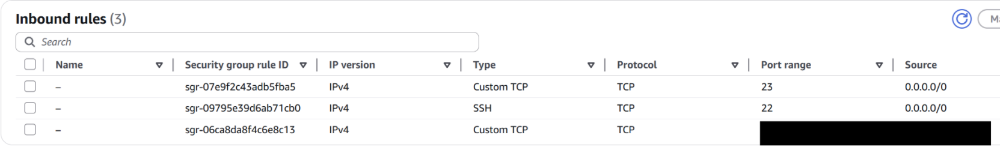
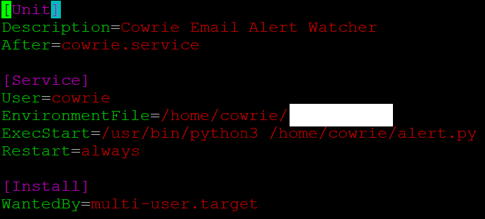
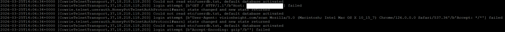
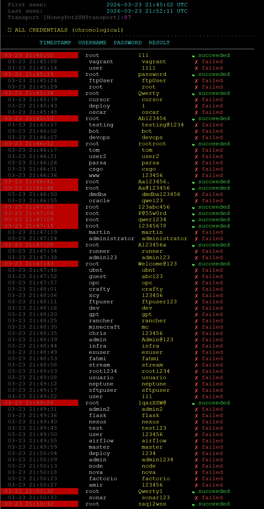
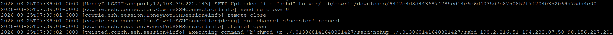
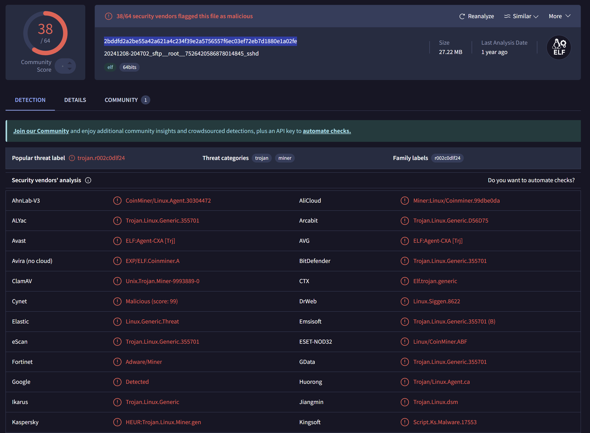
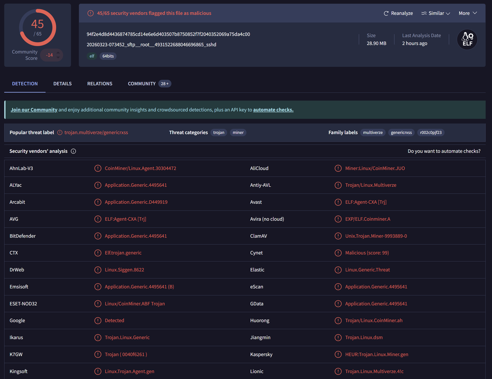

# Honeypot Research & Documentation

I recently started running a honeypot on a Linux server. This document covers what I've learned about both operating a honeypot and how real-world attackers behave in the wild.

---

## Table of Contents

- [My Setup](#my-setup)
- [Scripting & Notifications](#scripting--notifications)
- [Scanners](#scanners)
- [Credential Stuffing](#credential-stuffing)
- [Droppers](#droppers)
- [Malware Samples](#malware-samples)

---

## My Setup

My honeypot runs on AWS, using the open-source tool [Cowrie](https://docs.cowrie.org/en/latest/README.html).

I configured Cowrie to emulate both SSH (port 22) and Telnet (port 23). When doing this, it's important to move your real SSH service to a non-standard port, and to restrict who can access it. On AWS, this is easy to enforce with a Security Group rule that allows the real SSH port only from your own IP address.

Additionally, cowrie is configured to run on startup.

> **Note:** This guarantees that the only ports visible to real attackers are 22 and 23 — both of which lead to the honeypot services. 



---

## Scripting & Notifications

I wrote a Python script that tails Cowrie's log file and sends an automated email notification on every successful or failed login attempt.

The script fires almost immediately when an attacker connects. This can become noisy during active credential stuffing. I'd recommend using a dedicated email account, or switching to a different notification channel altogether (Slack, Pushover, etc.).


As you can see, this alert shows the address and credentials used by the address. This one in particular happened around 5am and originates from eastern china. 

To make sure the notification pipeline survives server restarts, I registered the script as a `systemd` service:



---

## Scanners

The most common traffic I see is from **automated scanning tools**. These bots sweep large IP ranges looking for open ports. Some of them misidentify port 23 (Telnet) as an HTTP service.

Notice how rapidly the connections happen, these are absolutely automated:

 
Here you can see an automated scanner attempts to connect to the telnet server with HTTP credentials, and attempts to emulate a real browser. 

---

## Credential Stuffing

After scanners detect an open service, credential stuffing bots follow. They work through large wordlists of username/password combinations automatically.

The wordlists themselves are interesting. One I captured had clearly been updated recently, as it included entries like `claude` and `gpt`:



The most active bot on my server attempted **88 username/password combinations**, achieving **18 successful logins**. On each successful login, it automatically ran:

```bash
uname -s -v -n -r -m
```

This command fingerprints the system. OS name, kernel version, hostname, architecture, likely gathering information for a dropper.

---

## Droppers

Droppers are the most malicious category I've observed. Their sole purpose is to deliver and execute malware. I've seen two distinct types.

### 1. SSH Login Droppers

These connect via SSH and, once authenticated, run a sequence of commands to download and execute a binary. They also attempt to establish persistence. For example: configuring the executable to run on startup.

### 2. SFTP Droppers

These connect directly via SFTP and silently upload a malware file, then attempt to connect and execute.



---

## Malware Samples

Below are samples of malware collected from dropper sessions. Most appear to be trojans designed to run cryptocurrency mining applications silently in the background.
### Sample 1, SHA: 2bddfd2a2be55a42a621a4c234f39e2a5756557f6ec03ef72eb7d1880e1a02fe


### Sample 2, SHA: 94f2e4d8d4436874785cd14e6e6d403507b8750852f7f2040352069a75da4c00



## Command Execution Breakdown

A reconnaisance bot recently connected to my honeypot and ran a very intricate recon command, here I will break it down:

```bash
export PATH=/usr/local/sbin:/usr/local/bin:/usr/sbin:/usr/bin:/sbin:/bin:$PATH\nuname=$(uname -s -v -n -m 2>/dev/null)\narch=$(uname -m 2>/dev/null)\nuptime=$(cat /proc/uptime 2>/dev/null | cut -d. -f1)\ncpus=$( (nproc 2>/dev/null || /usr/bin/nproc 2>/dev/null || grep -c "^processor" /proc/cpuinfo 2>/dev/null) | head -1)\ncpu_model=$( (grep -m1 -E "model name|Hardware" /proc/cpuinfo | cut -d: -f2- | sed \'s/^ *//;s/ *$//\' ; lscpu 2>/dev/null | awk -F: \'/Model name/ {gsub(/^ +| +$/,"",$2); print $2; exit}\' ; dmidecode -s processor-version 2>/dev/null | head -n1 ; uname -p 2>/dev/null) | awk \'NF{print; exit}\' )\ngpu_info=$( (lspci 2>/dev/null | grep -i vga; lspci 2>/dev/null | grep -i nvidia) 2>/dev/null | head -n50)\ncat_help=$( (cat --help 2>&1 | tr \'\\n\' \' \') || cat --help 2>&1)\nls_help=$( (ls --help 2>&1 | tr \'\\n\' \' \') || ls --help 2>&1)\nlast_output=$(last 2>/dev/null | head -n 10)\necho "UNAME:$uname"\necho "ARCH:$arch"\necho "UPTIME:$uptime"\necho "CPUS:$cpus"\necho "CPU_MODEL:$cpu_model"\necho "GPU:$gpu_info"\necho "CAT_HELP:$cat_help"\necho "LS_HELP:$ls_help"\necho "LAST:$last_output"'"
```

This command very clearly runs commands to gain information about the target system. 

#### 1. To start, it runs `export` to make sure the following command binaries will be found (like uname), even if the system is in a restricted environment. 

#### 2. Then it gathers the basic system info with `uname (-s: kernel, -v: kernel version, -n hostname, -m architecture)`, and sends errors to the void. 

#### 3. Reads uptime from /proc/uptime with `cat`. 

#### 4. Uses multiple methods to gather CPU info. Tries `nproc` then reads `/usr/bin/nproc` then counts cpu lines in `/proc/cpuinfo` and limits results to one. 

#### 5. Finds CPU model using another chain of commands. Looks in `/proc/cpuinfo`, tries `lscpu`, `dmiencode`, and `uname -p`.

#### 6. Gathers GPU info using `lspci`. lspci returns a list of pci devices, which the command filters using keyword nvidia and vga. 

#### 7. Gets help results from common commands `cat` and `ls`. This is likely another tool for fingerprinting, which can match the result to system versions and even honeypots. 

#### 8. Accesses the last 10 login sessions using `last` and `head`. 

#### 9. Prints the output that was assigned to variables into a nicely formatted list using `echo`. 

